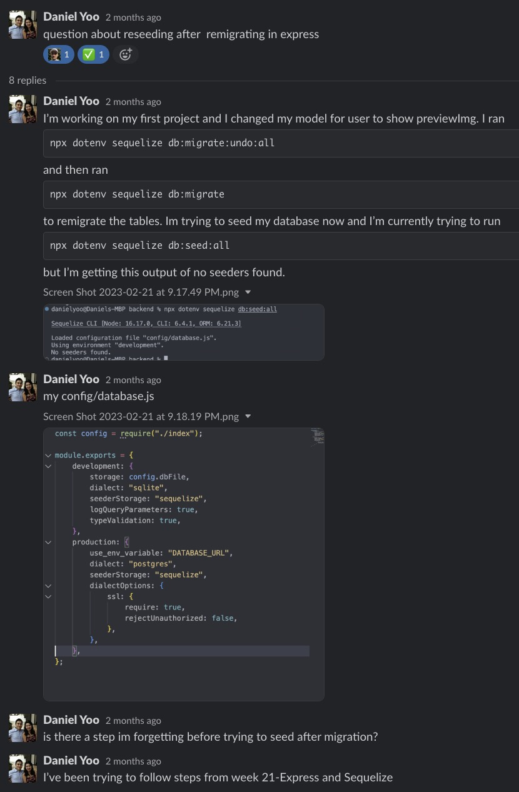

# Long ago, we asked bad questions in harmony

## ...and then everything changed when Mod 2 attacked 🔥

Mod 2 scales up in complexity, but also in expectations

Hard content === survival of the question askers

Asking **_`good`_** **_`questions`_** is an important SWE skill

### Question quality requirements are now in place, and those requirements will increase as time goes on

- Today, we're asking poor questions (that's okay!)
- By end of Mod 2, we'll be asking good questions
- By our first project, we'll be asking great questions
- By our final project, we'll be asking **_excellent_** questions
  - And rarely asking questions at all!

### **This is a learning process, so don't be scared!!!**

- No penalty for poorly worded questions, so ask away!
  - You're expected to ask **_more_** questions, not less

## How to ask a good question

Very little effort required to take a question from bad to good

- It takes a lot to go from good to excellent, but we have time to get better!

### Our current questions often look something like this:

### From now on we expect questions to look like these at minimum:

These questions are better because:

- Tells us what you're working on
- Tells us the problem you're running into

### So, the good question recipe is

1. Give the problem your best attempt for 15 minutes
2. Tell us what problem you're on
3. Tell us what's going wrong with your code

## Tony The Tiger is not impressed

By the time we get to our first project, you'll be expected to ask great questions.

The biggest differences between good & great questions are **_effort_** invested in solving the problem and **_effort_** invested in providing information.

### The great question recipe is

1. Give the problem your best attempt for 15 minutes
   - Includes looking up answers online
2. Tell us what problem you're on
3. Tell us what's going wrong with your code
4. Show us code blocks/screenshots of your code/error
5. Tell us what you've tried already
6. Tell us what you found while researching

If you wish to try to incorporate some of these steps into your questions now, you can!

- Practice makes perfect!
- Just know that it's not required currently

---

## This type of question is the endgame, eventually all our questions will look like this!

### This is an excellent question because:

- Gives us a subject line to understand a lot about the problem in just a few words
- Main content of the question is in a thread
- Tells us exactly what commands were ran and in what order
- Provides the exact error output
- Provides the related files
- Tells us what they think might be the problem
- Points to the exact instructions they're following

---

---

---

---

---

---

---

---

---

---

## [Dehydrated Syrup](./DRY_SRP.md)
