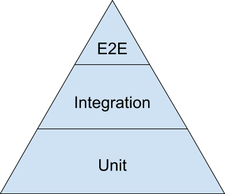
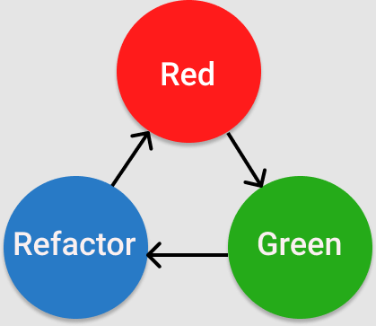

# Writing Tests 😒🫸 Passing Tests 😏👆

## RangeError: Too much content

- Practice makes perfect, Insanely Long Practice makes...
- Not enough time in class to lecture on everything
  - Your struggle outside of class === Our focus during class
- Only reading tests on Assessment - Don't Stress!
  - Writing helps you read!!!
- Upgrading our questions!
  - Include your error in a code snippet
  - Makes answering questions faster
    - Sometimes, we may not even have to join your room!

---

## `try`, `catch`, `finally`

### `try`

- Runs every time
- If an error occurs inside of it, passes to `catch`

### `catch`

- Only runs if an error is **_`thrown`_**
- Can run with or without `()`
  - Won't "see" the error without them
- Requires an argument in its `()` to represent the error

### `finally`

- Literally always runs
- No seriously like literally nothing can stop this beast
  - Well actually syntax errors can but shhhh

```js
const myErrorMaker = () => {
  try {
    const myError = new Error("My very own error!");
  } catch (error) {
    console.log("Hey look at me I didn't error!");
    return "Some other thing";
  } finally {
    console.log("\n\n I am inevitable!!!! \n\n");
  }
};

myErrorMaker();
```

---

## Purposes of Error Handling

```js
const arrayContainsVowel = (arr) => {
  const vowels = "aeiouAEIOU";

  return arr.some((str) => {
    return str.split("").some((char) => vowels.includes(char));
  });
};

console.log(arrayContainsVowel(["fftw", "plnm"])); // false
console.log(arrayContainsVowel("Dear god help me")); // TypeError: arr.some is not a function
```

---

### Prevent an error from halting execution

```js
const arrayContainsVowel = (arr) => {
  const vowels = "aeiouAEIOU";

  try {
    return arr.some((str) => {
      return str.split("").some((char) => vowels.includes(char));
    });
  } catch (error) {
    if (typeof arr === "string") {
      arr = arr.split(" ");
    }
    return arr.some((str) => {
      return str.split("").some((char) => vowels.includes(char));
    });
  }
};

console.log(arrayContainsVowel(["fftw", "plnm"])); // false
console.log(arrayContainsVowel("Dear god help me")); // true
```

---

### Prevent incorrect function use & make errors clearer

```js
const arrayContainsVowel = (arr) => {
  if (!Array.isArray(arr)) {
    throw new TypeError("Input must be an array");
  }

  const vowels = "aeiouAEIOU";

  return arr.some((str) => {
    return str.split("").some((char) => vowels.includes(char));
  });
};

console.log(arrayContainsVowel(["fftw", "plnm"])); // false
console.log(arrayContainsVowel("Dear god help me")); // TypeError: Input must be an array
```

---

## Test Driven Development

### Testing Pyramid



- Unit Tests: Does this specific thing work?
  - Focuses on individual functions or tasks
- Integration Tests: Does this thing break that thing?
  - Tests how separate pieces of code work with one another
- End-to-End Tests: Does it all work together?
  - Tests the whole application
  - Close to the user experience

### TDD Process

The loop of
easily maintainable, fully tested, clean code



- Red: Write tests, watch them fail
  - THIS IS THE MOST IMPORTANT STEP!!!
- Green: Write code, just enough to pass the tests
- Refactor: Write more tests, watch them fail, pass the tests

---

## Writing Tests

### Use the HW Reading

- If you didn't follow along with it, start there first!

### **_USE YOUR PAST PRACTICES_**

- You have tons of reference code at your disposal!

### **Use the docs**

- [Chai - **_`expect`_**](https://www.chaijs.com/api/bdd/)

- [Mocha - **_describe_**, **_it_**, **_beforeEach_**, **_afterEach_**](https://mochajs.org/)
