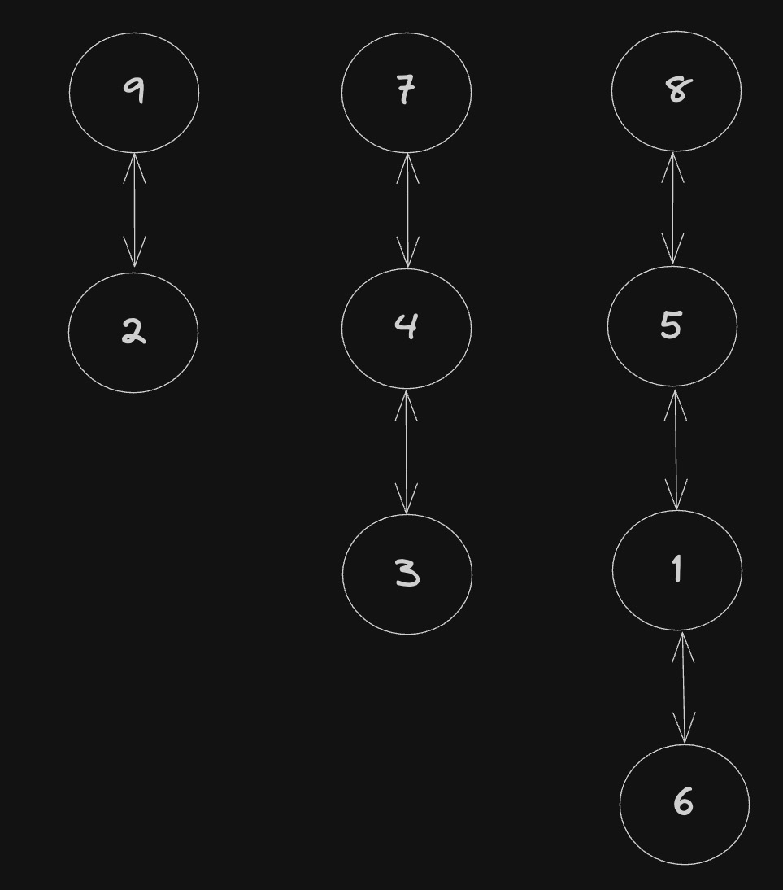

# "He's beginning to believe" - Morpheus after watching Neo solve Counting Islands

## `Adjacency Lists` vs `Matrices`

An `adjacency list` is a way of representing a `graph` with an object

A `matrix` is a way of representing a `graph` as a `2D Array`

### Here's a graph represented by an adjacency list

```js
const adjList = {
  1: [5, 6],
  2: [9],
  3: [4],
  4: [3, 7],
  5: [1, 8],
  6: [1],
  7: [4],
  8: [5],
  9: [2],
};
```

### Here's what this graph could look like if drawn out



### This drawing helps us visualize, but we don't have any concept of positioning within our graph

Adjacency lists are fine to know what nodes are next to each other, but where do those groups of nodes sit in the larger picture of our data?

- Sometimes position might not matter at all
- Other times, it can be critically important

### `Matrices` give us a more detailed look at where each node exists

Here's the matrix for the adjacency list above

```js
const matrix = [
  [0, 3, 4, 0, 8],
  [0, 0, 7, 0, 5],
  [0, 0, 0, 6, 1],
  [0, 2, 0, 0, 0],
  [0, 9, 0, 0, 0],
];
```

Both versions show us the same data, but each has different applications

- We now have the context that `6` & `7` are "close" to each other
- We couldn't see that with the `adjacency list`

---

## Seeing Through The Matrix

Locating the exact coordinates of a value in a `2D Array` can be daunting

It's very easy to get mixed up when using a nested for loop with `i` & `j`

- Which `i` value are we at?
- Which `j` value are we at?

```js
const matrix = [[0, 3, 4, 0, 8], [0, 0, 7, 0, 5], [0, 0, 0, 6, 1], [0, 2, 0, 0, 0], [0, 9, 0, 0, 0]];
-

for (let i = 0; i < matrix.length; i++) {
  for (let j = 0; j < matrix[0].length; j++) {
    matrix[i][j]
  }
}
```

It's a lot easier to approach it as a grid

- Which `row` are we on?
- Which `column` are we on?

```js
const matrix = [
  //  column 0  1  2  3  4
  /*row 0*/ [0, 3, 4, 0, 8],
  /*    1*/ [0, 0, 7, 0, 5],
  /*    2*/ [0, 0, 0, 6, 1],
  /*    3*/ [0, 2, 0, 0, 0],
  /*    4*/ [0, 9, 0, 0, 0],
];

for (let row = 0; row < matrix.length; row++) {
  for (let col = 0; col < matrix[0].length; col++) {
    matrix[row][col];
  }
}
```

### A nice pattern to memorize

- `row` === `i` === first/outer for loop
- `col` === `j` === second/inner for loop

---

## Solving Matrix Graph Problems

**`3 steps to solving almost any graph problem:`**

1. Identify the type of `graph`
2. Implement a `getNeighbors` function
3. Traverse the `graph`

### **`1. Identify the type of graph`**

Ask yourself the following questions when trying to identify the type of `graph`:

- What is the problem asking you to do?
- What does the `matrix` represent?
- What does each `node` represent?
- What relationship do the `edges` represent?
- What is considered a valid neighbor, in the context of this problem?
- Is this a search or traversal problem?
- Does this require a `depth-first` or `breadth-first` approach?

### **`2. Implement the getNeighbors function`**

Here is the pseudocode for a `getNeighbors` function for a matrix:

```js
const matrix = [
[ 0, 1, 0, 0, 1 ],
[ 1, 0, 0, 0, 1 ],
[ 1, 1, 0, 1, 1 ],
[ 0, 1, 1, 0, 0 ],
[ 0, 0, 0, 0, 0 ]
];

function getNeighbors(`node`, matrix) {
    // Create an `array` to hold the valid neighbors

    // UP:
        // Identify the `node` above the current `node`, if it exists
        // Push that `node` into the new `array`

    // DOWN:
        // Identify the `node` below the current `node`, if it exists
        // Push that `node` into the new `array`

    // LEFT:
        // Identify the `node` to the left of the current `node`, if it exists
        // Push that `node` into the new `array`

    // RIGHT:
        // Identify the `node` to the right of the current `node`, if it exists
        // Push that `node` into the new `array`

    // Return the neighbors `array`
}

// returns the correct neighbors from an internal node
getNeighbors([2,2], matrix) // returns [ [1,2], [3,2], [2,1], [2,3] ]

// returns the correct neighbors from a corner `node`
getNeighbors([0,0], matrix) // returns [ [1,0], [0,1] ]

// returns the correct neighbors from an `edge` `node`
getNeighbors([2,0], matrix) // returns [ [1,0], [3,0], [2,1] ]
```

### Let's think about how to achieve these steps

- How would you check to see if there is a `node` above the current `node`?
  - We have our current `node`'s row and column
  - In a `2D array`, a lower number is "higher" row in the grid
  - Decrement the row by 1, the column will stay the same
- How would you check to see if there is a `node` to the right of the current `node`?
  - We have our current `node`'s row and column
  - In a `2D array`, a higher number is further right in the grid
  - Increase column by 1, the row will stay the same

> Make sure you plan accordingly for corners and `edges`. Check that the index of the neighbor exists in your conditionals.

### **`3. Traverse the graph`**

Similar to an adjacency list except the starting node is a set of coordinates

- Create a `queue` and enqueue the starting `node`
- Create a `set` to store visited `nodes`
- While the `queue` is not empty, repeat steps 4-6
- Dequeue the first `node` and check if it's been visited
- If not, mark it as visited and DO THE THING
- Put all its neighbors in the back of the `queue`

## **_Careful When Adding Arrays To A `Set`!!!_**

You **MUST** use a **string representation** of the `matrix` coordinate

Otherwise the `Set` will only prevent the **_same array in memory_** from being duplicated

## BAD

```js
const visited = new Set();
visited.add([1, 2]);

console.log(visited); // Set(1) { [ 1, 2 ] }
console.log(visited.has([1, 2])); // false
```

## GOOD

```js
const visited = new Set();
visited.add(`${[1, 2]}`);
// OR
visited.add([1, 2].toString());

console.log(visited); // Set(1) { '1,2' }
console.log(visited.has(`${[1, 2]}`)); // true
console.log(visited.has([1, 2].toString())); // true
```
