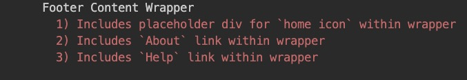
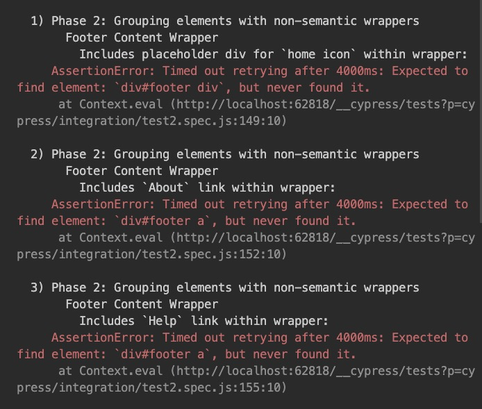

# Art Class For Tech Nerds

## Do or Do Not, There Is No Lecture

When it comes to HTML/CSS, the **_BEST_** way to learn is by doing!

Things won't be as lecture heavy as Mod 2 - thank god lmao 😅

## Keep up good question asking!!!

If you're getting a cypress error, which is more relevant to make it easier for us to help you?

This:

Or this:

### Now, let's always add the code in question!

---

## When working through problems, use Live Server!

Once you're finished, ask for a code review
