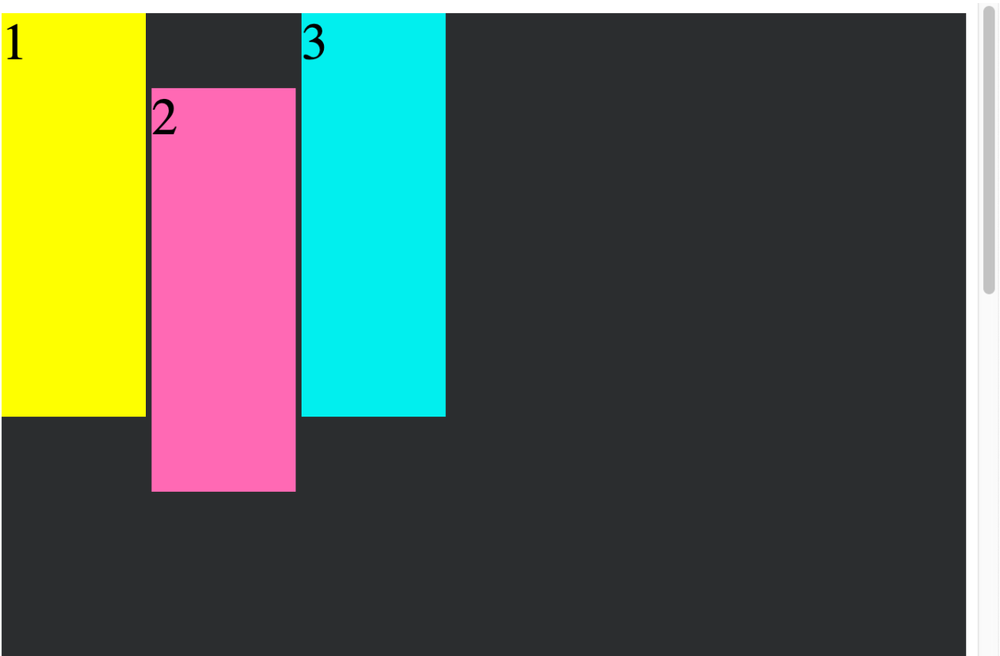

# Simple Problems Require Complex Solutions

## Today's Plan

- Do first 3, then walkthrough
- Do last 3, then walkthrough
- `CSS Basic Styling` & `CSS Positioning` are just exploratory

---

## `Positioning`

Allows your to manipulate where an element will appear on the page.

Can accept 1 of 5 values:

### - `static`

- default position value
- appears on page according to page flow

  ```css
  #pink-box {
    background-color: #ff69b4;
    position: static;
  }
  ```

  

---

### - `relative`

- `element` will be positioned _relative_ to its `initial place in the page flow`.
- can be offset using `top`, `right`, `bottom`, `left`, and `z-index` (_forward and back_) properties.
- the above properties expect a length (`px`, `em`, `rem`) or a percentage.

  ```css
  #pink-box {
    background-color: #ff69b4;
    bottom: 0;
    left: -20px;
    position: relative;
    right: 0;
    top: 0;
  }
  ```

  

---

### - `absolute`

- `element` is removed from the page flow
- positioned in relation to closest **positioned** ancestor `element`
- other `elements` will not be affected by this element
- can be offset using `top`, `right`, `bottom`, and `left` properties (_stacking context applies_)

```css
.container {
  background-color: #2b2d2f;
  position: relative;
}

#pink-box {
  position: absolute;
  top: 60px;
}
```

  

---

### - `fixed`

- `element` is removed from the page flow
- positioned relative to the <html> doc itself.
- can be offset using `top`, `right`, `bottom`, and `left` properties (_stacking context applies_)
- will remain in the same position even if the page is scrolled.

```css
#pink-box {
  background-color: #ff69b4;
  left: 300px;
  position: fixed;
  top: 15%;
}
```

  
  

---

### - `sticky`

- `element` remains in its original position in the page flow
- positioned relative to closest block-level ancestor and any scrolling ancestors
- behaves as a relatively positioned element until you scroll past it in the viewport.
- must set to stick using either `top`, `right`, `bottom`, and `left` properties (_stacking context applies_)
- is relative until the stick point is reached, then is fixed afterward

```css
#pink-box {
  background-color: #ff69b4;
  position: sticky;
  top: 60px;
}
```

  
  

