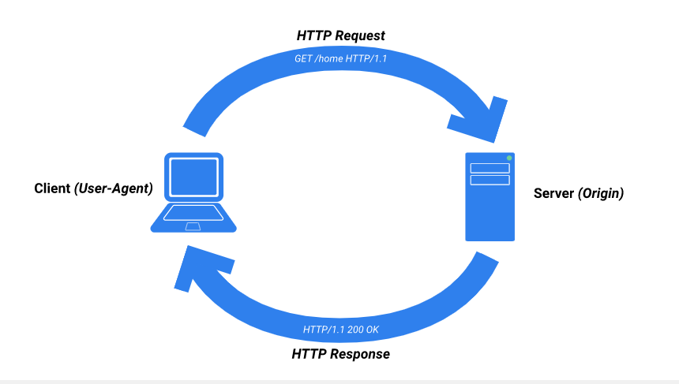
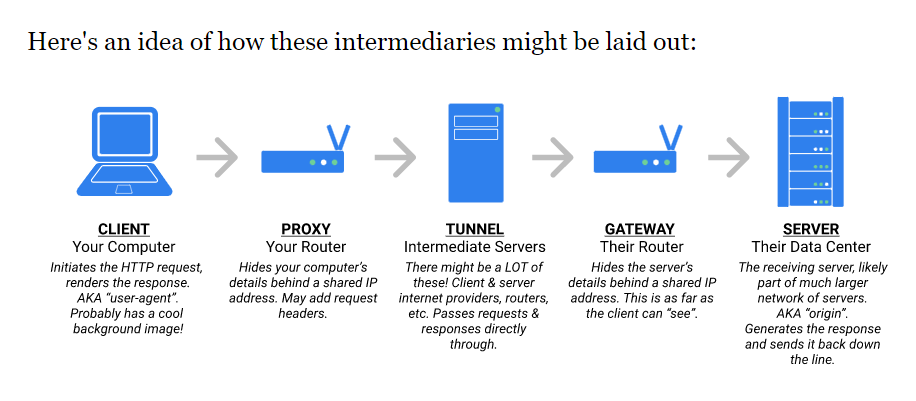
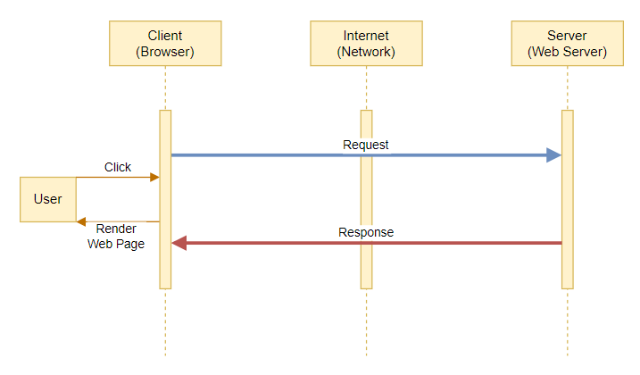
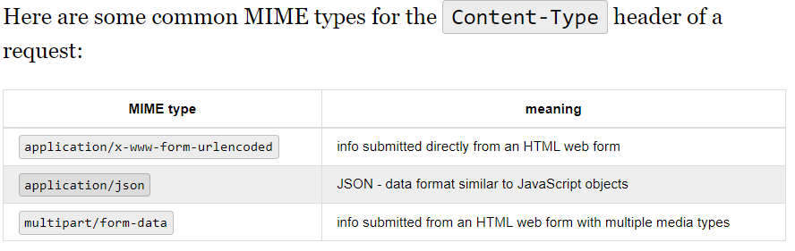
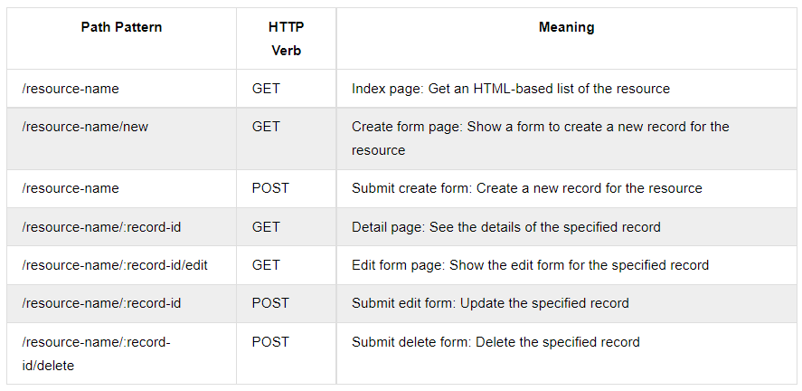
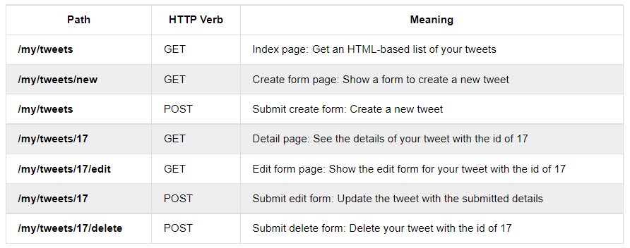
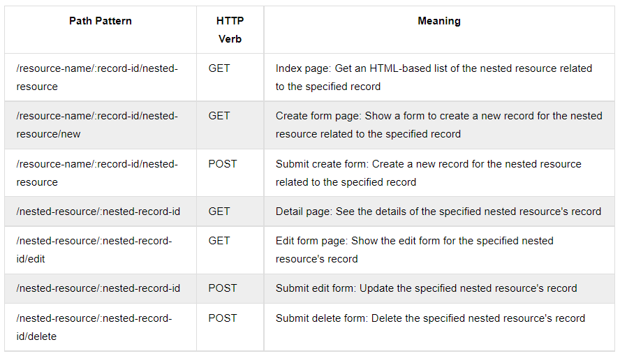

# **`Welcome to the Internet`**

> ## Helpful Links
>
> [The HTTP Spec](https://www.rfc-editor.org/rfc/rfc2616#section-1.4)
>
> [MIME Types](https://www.iana.org/assignments/media-types/media-types.xhtml#application)
>
> [MDN Mime Types](https://developer.mozilla.org/en-US/docs/Web/HTTP/Basics_of_HTTP/MIME_types/Common_types)
>
> [MDN HTTP Headers](https://developer.mozilla.org/en-US/docs/Web/HTTP/Headers)

This week we will be learning about `HTTP`, `REST`, and `Servers`!

- **`HTTP`**: A protocol for fetching resources
  - Foundation of any data exchange on the web
- **`REST`**: Acronym for `Re`presentational `S`tate `T`ransfer
  - Ruleset that defines best practices for sharing data between clients and the server
- **`Server`**: Hardware or software that takes client `requests` for data and sends `responses` back with that data

---

## `Servers`

First lets clear up what `Full-Stack` means. A `full-stack` app is an app that has both a `frontend` and a `backend`.

- **`Frontend`** (**User Interface**)

  - The part that the client sees and interacts with, the stuff on the page
  - Will use `HTML`/`CSS`, `Javascript`, `React`

- **`Backend`** (**The Server**)
  - The part that's working behind the scenes to make sure the data our page needs is available and sending it in a `response` when a `request` is made
  - Will use `Javascript`/`Expressjs`/`Sequelize`, `Python`/`Flask`

## `HTTP`

- HT: `HyperText`: Content with references to other content (`HTML`: HyperText Markup Language)
- TP: `TransferProtocol`: Defines the expectations for both ends of the transfer - the **`request/response protocol`**

  - Works between `clients` and `servers`
  - `requests` are sent from the `client`
  - `servers` receive the `request`, `fetch` the needed data, and send a `response` back with that data

  

### `Properties of HTTP`

- **Reliable Connections**: sacrifice speed for reliability
- **Stateless Transfer**: doesn't store any information
- **Intermediaries**: other servers that pass your request along to the correct place, there are 3 types:
  - **`proxy`**: may modify your request so it appears to come from a different place
  - **`gateway`**: pretends to be the resource server
  - **`tunnel`**: simply passes the request along



## Another look at the `Request/Response Cycle`



The browser parses `HTML`, `CSS`, and `JS`, then renders that info to the user by constructing and rendering as a [DOM tree](https://developer.mozilla.org/en-US/docs/Web/API/Document_Object_Model)

---

## **`HTTP Requests`**

### `Request Overview`

Made up of the following information:

- **`Request-line`**

  - First line of a `request` in 3 parts:
    - The `method` a.k.a `HTTP verb`
    - The `URI` (`U`niform `R`esource `I`ndicator) that identifies what has been requested
    - The `HTTP` version you want to use (Usually `HTTP`/1.1 or `HTTP`/2)

- **`Headers`**

  - Key/values that define metadata needed to process the `request`

- **`Body`**
  - Extra information
  - Usually form data or files
  - Used with the `Content-Type` header

### `Content-Type Header`

- **Defines details about the body of the request**
- Lets the server know the format of the body data and how to process it
- Values are MIME Types (Media Types)



### `HTTP Verbs`

- Determine the **`CRUD`** operation of the request
  - `Create` - create new resources
  - `Read` - get resources from database
  - `Update` - change a resource
  - `Delete` - remove a resource

#### `Most commonly used verbs`

- `GET`
  - Used for **retrieving resources**
  - When you go to a link, the browser makes a `GET` request
  - **Will never have a body**
- `POST`
  - Used for **creating new resources**
  - When you submit a form, the browser makes a `POST` request
  - **Can have a body**, usually containing form data
- **`PUT`**
  - Used to **update a resource**
  - Will contain the **ENTIRE resource** you'd like to update
  - **Can have a body**, usually containing all information about that resource including the updated information
- **`PATCH`**
  - Also used to **update a resource**
  - Does not require the entire resource, can update a single value
  - **Can have a body**, usually containing the single thing you want to update
- **`DELETE`**
  - **Destroys resources** on the server
  - **Can have a body**, but usually will not

## `HTML Form Requests`

- Attributes of an `HTML` form:

  - `method`: method of the request, should **ALWAYS** be `"POST"`
  - `action`: URL path of the request

- Request contents will include the above two attributes and also the following:
  - `Content-Type`: application/x-www-form-urlencoded
  - `Body`: form input names and values

---

## **`HTTP Responses`**

## `Response Overview`

Made up of the following information:

- `Status`
  - First line in the `response`
  - Includes the `http version` and the `Status-Code`
- `Headers`
  - Work identically to those on requests
  - Establish metadata that the client might need to process the response
- `Body`
  - Contains the resource that was requested

### `Status Codes`

3 digit numeric representation of a server `response`

Grouped by the first digit

- **`100-199`** : **Informational Codes**

  - Let the client know the req was received
  - Provide additional info from server
  - Unlikely to see them

- **`200-299`** : **Successful Codes**

  - Indicates the request has succeeded
    - `200 OK`
      - `Request` received and fulfilled
      - Usually come with a body containing the requested resource
      - Most common `response` period, expected from `GET` requests
    - `201 Created`
      - `Request` received and a new record was created as a result
      - Most common response to `POST` requests

- **`300-399`** : **Redirection Codes**

  - Lets the client know there has been a change in the location (URL Path) and redirects the user there
    - `301 Moved Permanently`
      - Requested resource has permanently moved to a new location
      - Redirects you to the new location
    - `302 Found`
      - Requested resource is temporarily in a new location
      - Redirects to the temp location

- **`400-499`** : **Client Error Codes**

  - Indicates a problem with the request
    - `400 Bad Request`
      - Server couldn't understand your request
    - `401 Unauthorized`
      - Resource may exist, but you're not allowed to see it without authentication
    - `403 Forbidden`
      - Resource may exist, but you're not allowed to see it at all (don't have the correct permissions)
    - `404 Not Found`
      - Resource doesn't exist

- **`500-599`** : **Server Error Codes**

  - Request was good, but the server couldn't respond as expected
    - `500 Internal Server Error`
      - Request was received but the server couldn't process it
    - `504 Gateway Timeout`
      - Request was received but the server didn't respond in a reasonable amount of time

## `HTML Form Responses`

Usually when a form is submitted, the server will redirect upon a successful request

1. Form is submitted
2. Browser makes request to the server
3. Server parses request body and does some CRUD action with the data
4. Server sends redirection response
5. Browser receives response
6. Browser redirects

---

## `ReSTful Routes Convention`

- Stands for `Re`presentational `S`tate `T`ransfer
- A **_convention_** for defining `endpoints`
- Helps other devs easily understand how the server may process `requests` with those `endpoints` and what the expected `responses` will be

### `Routes vs. Endpoints`

- A `route` is **ONLY** the `URL` path for a `request`
- An `Endpoint` is an `HTTP verb` and the `route`
  - Defines how the server should process and respond to the `request`

### `Route Parameters`

- Named segment of the URL path
  - Just a variable
- Indicated in the URL path by a colon `:`, followed by the name of the variable part of the path
- Enables us to use the same route to get different data of the same type

```js
// Say you are creating a notebook app. if you want to get the contents of the note with the id of 20, the path would probably look something like this:

// route in the request
/notes/20

// endpoint to get a note
// :noteId is the Route Parameter
"Get"
/notes/:noteId

// the route for this endpoint represents all routes that start with /notes/ and end in an id. We can use this same endpoint to get any note.
```

### `Rules of ReST`

- Not an official standard, just a set of rules/constraints

  - `Decoupled Client-Server`:
    - The client and server are not dependent upon each other
  - `Stateless`:
    - Data received from the server can be used by the client independently
  - `Uniform Interface`:
    - Self-describing and uniform
    - Each operation is handled by a separate endpoint
    - Should be split up depending on the CRUD action to be performed

### `Examples of ReSTful paths that return HTML`





### If you need to go into a specific resource and get specific information from it, you would use the following format!



```js
// Keeping up with the tweet example above
"GET" / my / tweets / 17 / comments; // get all comments on this tweet
"POST" / my / tweets / 17 / comments; // create a new comment
"GET" / my / comments / 25; // get details of this comment
```
